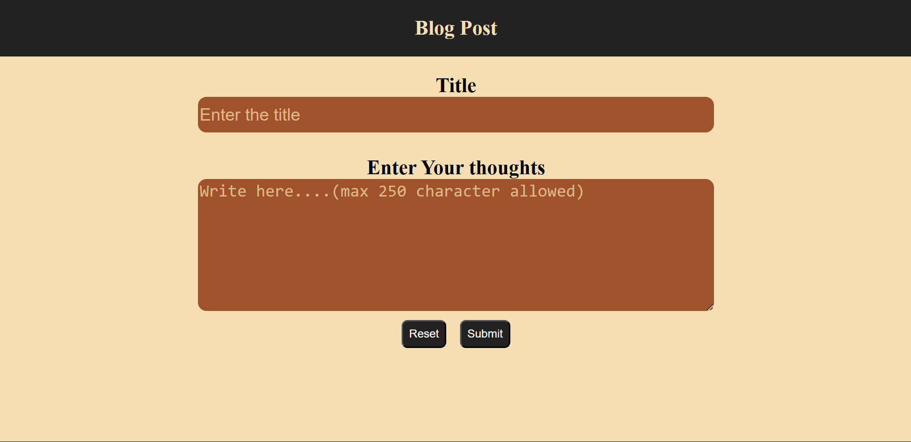
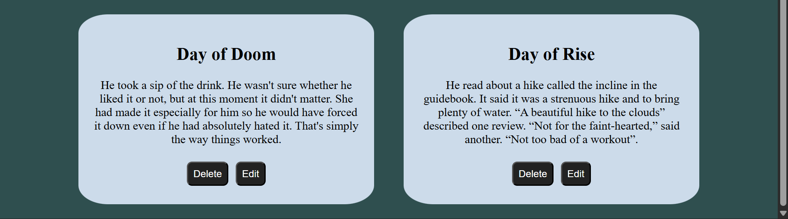

# Blog Post Website

This is a practice project created solely for learning purposes and to implement the knowledge I’ve gained.  
It’s a beautifully designed blog post website where users can create, update, and delete posts.  

---

## ✨ Features
- Create blog posts  
- Update blog posts  
- Delete blog posts  
- Responsive and clean design  

---

## 🛠️ Technologies Used
- **Frontend:** HTML, CSS, JavaScript, API Integration  
- **Backend:** Node.js + Express.js  
- **Database:** No database used  

---

## 🚀 Installation

1. **Install Node.js and npm** (if not already installed):  

   - On **Ubuntu / Debian (Linux):**  
     ```bash
     sudo apt update
     sudo apt install nodejs npm
     ```

   - On **Mac (with Homebrew):**  
     ```bash
     brew install node
     ```

   - On **Windows:**  
     Download and install from [Node.js official website](https://nodejs.org/).  

   **Verify installation:**  
   ```bash
   node -v
   npm -v
   ```

2. **Clone this repository** (preferred terminal: Bash):  
   ```bash
   git clone https://github.com/your-username/blog-website.git
   cd blog-website
   ```

3. **Install dependencies:**  
   ```bash
   npm install
   ```
   - Dependencies can be viewed inside `package.json`.  
   - After installation, a new directory `node_modules` will be created.  

---

## ▶️ Usage

Run the server using:  
```bash
npm run build
```

Run the server perpetually using:  
```bash
npm run dev
```

Then open your browser and go to:  
```
http://localhost:3000
```

---

## 📸 Screenshots

  
  

---

## 📂 Project Structure

```
blog-website/
  ├── controller/        # Handles request logic
  ├── node_modules/      # Installed dependencies (if installed)
  ├── public/            # Static frontend files
  │   ├── index.html     # Main HTML file
  │   ├── index.js       # Frontend JavaScript
  │   └── style.css      # Styling
  ├── routes/            # Express route handlers
  ├── .gitignore         # Git ignored files
  ├── app.js             # Main Express server file
  ├── package.json       # Project configuration and dependencies
  ├── package-lock.json  # Auto-generated lockfile for npm
  └── README.md          # Project documentation
```

## 📜 License
No license created — this project is only for **learning purposes**.  
